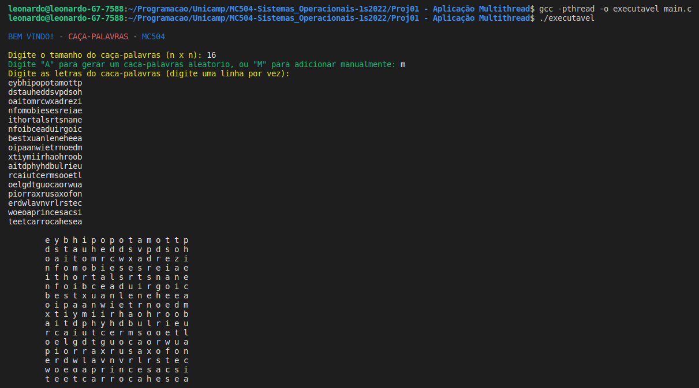
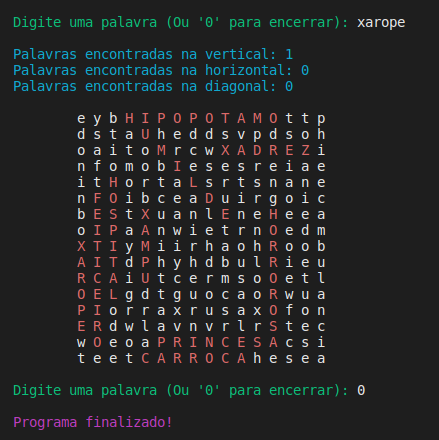

# Proj01 - Aplicação Multithread
## Caça-Palavras

Este programa utiliza threads durante a busca por palavras em um caça-palavras, para isso são necessarias 3 thread, suas funções são:
- buscar palavras na horizontal
- buscar palavras na vertical
- buscar palavras na diagonal

Para utilizar o programa devemos abrir o arquivo execultavel.

Os parametros necessarios iniciais são: 
- Tamanho da matriz do caça-palavras (n x n)
- Modo de geração da matriz ("A" para automatico e "M" para manual)
- Para o modo manual ("M") é necessario digitar a matriz de caracteres

> 

Depois basta digitar as palavras que encontrar, para sair digite "0".

> 