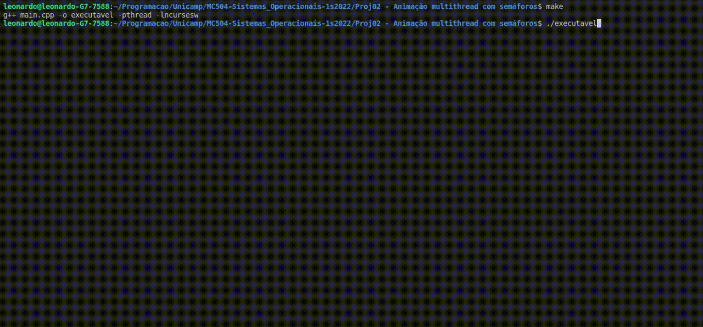

# Proj02 - Animação multithread com semáforos
## Obras e trabalhadores

Este programa utiliza threads e semafaros para gerir a construção de casas.
- trabalhadores se registram em uma fila de vaga de empregos
- se uma obra necessita de algum tipo de trabalhador ela publica a vaga
- o trabalhador inicia seu trabalho na obra.

Para utilizar o programa devemos abrir o arquivo execultavel.

Podemos modificar as seguintes constantes:
- N_TRABALHADORES: numero de trabalhadores, com tipos aleatorios.
- N_CASAS: numero de obras existentes.
- N_VAGAS: quantidade maxima de trabalhadores que poderam esperar na fila.
- N_TIPOS: tipos de trabalhadores existentes.
- N_CORES: numero de cores disponiveis para trabalhadores do tipo pintor.
- TEMPO: variavel para controle do tempo de cada tarefa.

> 